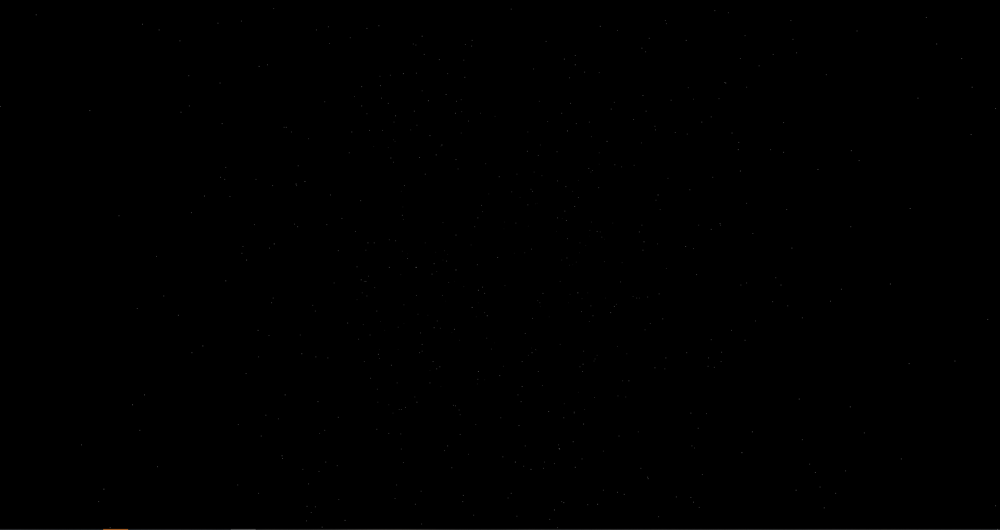

# T21STARS: Drawing dynamic stars
Last code update: 30.10.2021

This project draws stars moving past the camera. User can stop stars (SPACE), change stars' speed (1/2 keys), zoom image (+/- keys) and spin camera (RSHIFT/LSHIFT).  

